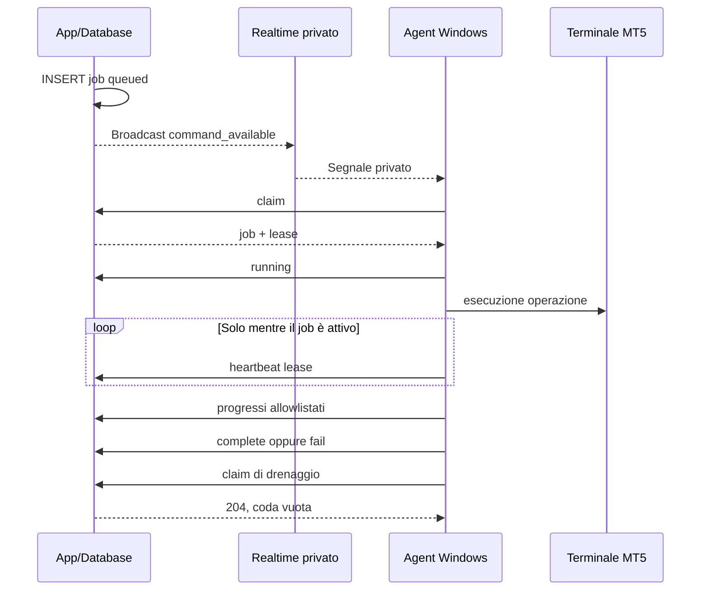
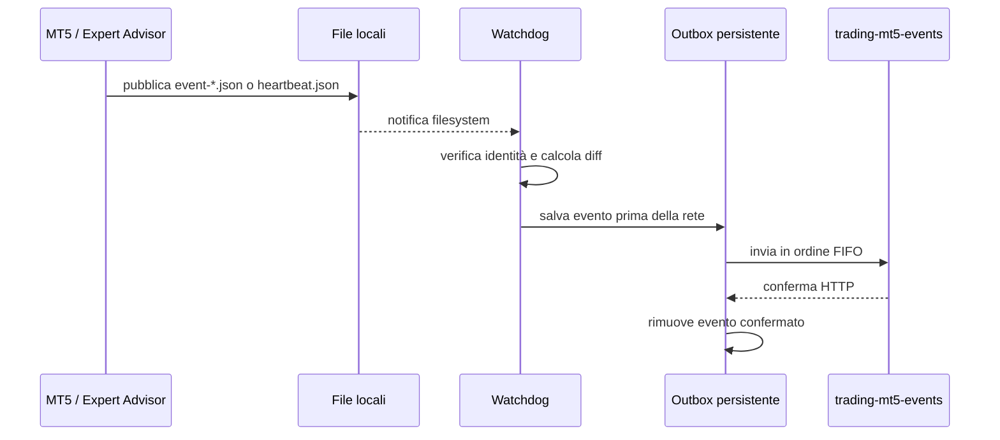

# Infrastruttura MT5 event-driven su VPS Windows

> Documento operativo e tecnico in linguaggio semplice
> Ultimo aggiornamento: 18 agosto 2026
> Ambito: account MT5 gestiti da TradeJournal tramite VPS Windows e Supabase

## 1. Riassunto in parole povere

La nuova infrastruttura funziona come un campanello, non come una persona che controlla la porta
ogni pochi secondi.

Nel vecchio sistema l'agente Windows chiedeva continuamente a Supabase:

> «C'è un lavoro per me? C'è un lavoro per me? C'è un lavoro per me?»

Questa richiesta veniva ripetuta circa ogni 5-17 secondi anche quando non succedeva nulla. Il
risultato era la creazione di migliaia di chiamate e migliaia di job `live_sync` inutili.

Nel nuovo sistema:

1. il comando viene salvato in una coda durevole nel database;
2. Supabase invia un piccolo segnale privato all'agente Windows;
3. l'agente si sveglia e preleva il comando dalla coda;
4. mentre esegue il comando comunica solo gli avanzamenti necessari;
5. quando non ci sono comandi, non interroga continuamente Supabase;
6. gli eventi di trading partono solo quando MT5 produce realmente una variazione locale.

Il segnale Realtime non contiene password, token del conto o dati del job. Dice soltanto:

> «Nella coda potrebbe esserci qualcosa: vai a controllare».

Se il segnale viene perso, il lavoro non viene perso: il job rimane nel database e viene recuperato
all'avvio o alla successiva riconnessione dell'agente.

## 2. Obiettivi della nuova architettura

La revisione è stata realizzata per ottenere questi risultati:

- eliminare il polling continuo di Supabase;
- eliminare i job `live_sync` periodici;
- mantenere i comandi durevoli e recuperabili;
- inviare alla piattaforma soltanto eventi reali o transizioni di connessione;
- evitare la perdita degli eventi quando Internet non è disponibile;
- impedire che due agenti eseguano contemporaneamente lo stesso job;
- proteggere password e token sulla VPS;
- impedire la creazione di connessioni MT5 gestite duplicate;
- mantenere MT5 completamente separato dalla logica pubblica dell'applicazione.

## 3. Vista generale


L'architettura è divisa in due piani indipendenti:

- **Control plane**: gestisce i comandi, per esempio provision, historical sync e deprovision.
- **Data plane**: trasporta soltanto eventi di trading e variazioni dello stato MT5.

Separare questi due piani evita che il flusso continuo dei dati interferisca con l'esecuzione dei
comandi amministrativi.

## 4. Tecnologie utilizzate

### 4.1 Supabase Postgres

Postgres è il database centrale e la fonte autorevole dello stato.

Contiene principalmente:

- connessioni di trading;
- agenti MT5 registrati;
- token degli agenti memorizzati come hash;
- coda dei job MT5;
- lease dei job;
- avanzamenti e risultati;
- snapshot del conto;
- token del bridge per l'ingestione degli eventi;
- eventi di trading importati.

In parole povere, Postgres è sia il registro ufficiale sia la cassetta delle lettere dei comandi.

### 4.2 Coda durevole `mt5_provisioning_jobs`

La coda non è un messaggio temporaneo in memoria: è una tabella Postgres.

Un job può attraversare questi stati:

```text
queued -> claimed -> running -> complete
                           \-> failed
queued/claimed/running     \-> cancelled
```

I job operativi supportati dal nuovo agente sono:

- `provision`: prepara una connessione MT5 gestita;
- `historical_sync`: importa lo storico richiesto;
- `deprovision`: arresta e rimuove in sicurezza l'istanza gestita.

`live_sync` rimane soltanto nello storico del vecchio sistema e non deve più essere usato come job
periodico.

### 4.3 Lease del job

La lease è paragonabile a un cartellino temporaneo con scritto:

> «Questo job è in lavorazione dall'agente X fino a questa scadenza».

Serve a evitare che due agenti eseguano lo stesso lavoro. Durante un job lungo l'agente rinnova la
lease con un heartbeat. Questi heartbeat sono corretti e necessari, ma esistono soltanto mentre il
job è in esecuzione.

Se l'agente perde la lease:

- non può dichiarare il job completato;
- interrompe il flusso in modo fail-safe;
- il database può rendere nuovamente disponibile il job dopo la scadenza.

### 4.4 Supabase Realtime Broadcast privato

Realtime viene usato esclusivamente come segnale di risveglio.

Ogni agente ascolta due topic privati:

- `mt5-agent:any`, per i segnali generali;
- `mt5-agent:<agent-id>`, per i segnali destinati al singolo agente.

Quando il database registra un comando disponibile, un trigger invia
`command_available`. L'agente esegue quindi `claim` fino a quando riceve HTTP 204, cioè «non ci sono
altri job».

Broadcast non sostituisce la coda. Se il WebSocket si interrompe, il job rimane nella tabella.

Supabase ha bloccato le modifiche generiche allo schema `realtime`, ma continua a permettere le
policy RLS su `realtime.messages`, che è esattamente il meccanismo usato qui.

### 4.5 Supabase Auth per l'identità macchina

L'agente possiede un token lungo `tjagent_...`, protetto sulla VPS tramite DPAPI. Questo token non
viene usato direttamente per collegarsi al WebSocket.

Il flusso è:

1. l'agente chiama `POST /trading-agent/session`;
2. la Edge Function verifica hash, scadenza, revoca e scope del token;
3. viene emesso un JWT Supabase Auth breve, normalmente di un'ora;
4. il JWT contiene gli scope in `app_metadata`, che l'utente non può modificare;
5. il JWT permette di entrare soltanto nei topic Realtime autorizzati.

La service-role key di Supabase non viene mai inviata alla VPS.

### 4.6 Edge Function `trading-agent`

Questa funzione è l'API privata del control plane.

Route principali:

- `POST /session`;
- `POST /claim`;
- `POST /jobs/{id}/running`;
- `POST /jobs/{id}/heartbeat`;
- `POST /jobs/{id}/progress`;
- `POST /jobs/{id}/complete`;
- `POST /jobs/{id}/fail`.

La verifica JWT standard della piattaforma è disabilitata perché l'agente usa un token macchina
dedicato, non il JWT di un utente dell'app. La funzione non è però pubblica: applica internamente
controlli su formato, hash, revoca, scadenza, rate limit e scope.

Versione verificata in produzione: **20**.

### 4.7 Edge Function `trading-mt5-events`

Questa funzione appartiene al data plane. Riceve:

- apertura, modifica e chiusura dei trade;
- variazioni di volume;
- creazione, modifica o cancellazione di ordini pendenti;
- snapshot del conto quando necessari;
- transizioni `connected=true` o `connected=false`.

Ogni connessione usa un bridge token dedicato. La funzione non riceve la password MT5.

Versione verificata in produzione: **22**.

### 4.8 Servizio Windows

L'agente gira come servizio Windows:

```text
TradeJournalMT5Agent
```

Caratteristiche principali:

- avvio automatico;
- esecuzione con identità `LocalSystem`;
- wrapper di servizio basato su `pywin32`;
- log persistenti locali;
- filtro per mascherare dati sensibili;
- riconciliazione delle istanze al riavvio;
- gestione di thread separati per comandi, Realtime, pool ed eventi locali.

### 4.9 Python

Il worker Windows è scritto in Python. Le librerie principali sono:

- `httpx`: chiamate HTTPS al control plane;
- `websocket-client`: connessione Supabase Realtime;
- `watchdog`: osservazione degli eventi filesystem;
- `pywin32`: servizio Windows, DPAPI e ACL;
- `psutil`: gestione e verifica dei processi;
- `cryptography`: decifratura dell'envelope delle credenziali;
- `sqlite3`: deduplicazione locale persistente.

### 4.10 MetaTrader 5 e MQL5

Ogni connessione gestita utilizza un terminale MT5 isolato. Un Expert Advisor MQL5 read-only
pubblica file JSON locali con scrittura atomica.

Il bridge non esegue operazioni di trading. Legge soltanto:

- identità del conto;
- server effettivo;
- stato della connessione;
- saldo, equity, valuta e leva;
- posizioni, ordini e deal;
- eventi generati da MT5.

L'agente verifica inoltre che l'accesso sia realmente investor/read-only.

### 4.11 DPAPI e ACL Windows

DPAPI cifra i segreti usando l'identità Windows del servizio. Un file DPAPI copiato su un'altra
macchina o letto da un'altra identità non è direttamente utilizzabile.

Sono protetti in questo modo:

- token dell'agente;
- chiave di provisioning;
- password investor MT5;
- login e server associati all'istanza;
- bridge token.

Le directory e i file ricevono ACL restrittive per limitare l'accesso all'identità che li ha
creati.

### 4.12 Cifratura AES-256-GCM delle credenziali

La password investor non viene salvata in chiaro nel job. Il database conserva un envelope
cifrato AES-256-GCM.

L'agente:

1. riceve l'envelope dopo aver acquisito la lease;
2. lo decifra localmente;
3. salva la password tramite DPAPI;
4. azzera appena possibile la variabile in memoria;
5. non registra mai la password nei log.

## 5. Flusso completo di un nuovo job



### Perché esiste la claim dopo il Broadcast

Il Broadcast non assegna il lavoro. Potrebbero esserci più agenti, una riconnessione o un messaggio
duplicato. La `claim` nel database decide atomicamente chi possiede il job.

### Perché viene fatto il drain

Dopo aver ricevuto un segnale, l'agente continua a fare claim finché la coda è vuota. In questo
modo un singolo segnale può far elaborare più job già accodati.

## 6. Flusso completo di un evento MT5



### Eventi di trading

Quando compare `events/event-*.json`, il supervisore:

1. legge snapshot precedente e corrente;
2. normalizza l'evento;
3. calcola un `event_id` stabile;
4. controlla la deduplicazione SQLite;
5. salva il payload nell'outbox;
6. prova a inviarlo;
7. elimina il marker locale soltanto dopo aver messo l'evento in sicurezza.

### Stato della connessione

`heartbeat.json` viene osservato localmente, ma non viene inoltrato a ogni aggiornamento. La rete
viene usata soltanto quando cambia `terminal_connected`:

- `false -> true` produce una transizione connected;
- `true -> false` produce una transizione disconnected;
- `true -> true` non produce chiamate;
- `false -> false` non produce chiamate.

## 7. Outbox persistente

L'outbox è una coda locale su disco. Risolve il problema:

> «MT5 ha prodotto l'evento, ma Internet è caduto prima che Supabase lo ricevesse».

Proprietà:

- persistenza su disco;
- ordine FIFO;
- scrittura atomica;
- deduplicazione per `event_id`;
- stop al primo errore transitorio per preservare la causalità;
- dead-letter per rifiuti permanenti;
- compatibilità Windows senza primitive POSIX non disponibili.

L'ordine è importante: una modifica o una chiusura non deve arrivare prima dell'apertura del trade.

## 8. Deduplicazione

La stessa notifica filesystem o lo stesso Broadcast possono arrivare più volte. Questo è normale
nei sistemi distribuiti.

La protezione avviene su più livelli:

- claim atomica del job;
- lease univoca;
- progressi idempotenti;
- `event_id` stabile;
- database SQLite locale dei payload già consegnati;
- vincoli e upsert lato ingestione.

L'obiettivo non è promettere che un messaggio venga visto una sola volta, ma garantire che i suoi
effetti vengano applicati una sola volta.

## 9. Pool delle istanze MT5

Copiare e preparare un terminale MT5 può essere lento. Per questo la VPS mantiene un piccolo pool di
istanze già predisposte.

Directory principali:

```text
C:\TradeJournal\mt5-template
C:\TradeJournal\instance-pool\building
C:\TradeJournal\instance-pool\ready
C:\TradeJournal\instance-pool\claimed
C:\TradeJournal\instances\<connection-id>
C:\TradeJournal\secrets\<connection-id>
```

Quando arriva un provision:

1. viene riservato uno slot ready;
2. lo slot viene spostato atomicamente tra i claimed;
3. viene verificato l'hash degli asset;
4. viene pubblicato come directory definitiva della connessione;
5. il pool crea in background un nuovo slot sostitutivo.

È stato corretto un problema Windows per cui `MoveFileExW` con `WRITE_THROUGH` restituiva
`Access denied` sulle directory non vuote. Per le directory viene ora usato il rename atomico
nativo con destinazione non esistente.

## 10. Riconciliazione dopo un riavvio

All'avvio il servizio non elimina indiscriminatamente i processi MT5.

Classifica le istanze in:

- **adopted**: processo e stato sono validi, quindi vengono riadottati;
- **missing**: istanza presente ma processo da recuperare;
- **terminated**: processo invalido o ambiguo, arrestato in sicurezza;
- **blocked**: situazione che richiede intervento operatore.

Le istanze `missing` valide vengono recuperate subito con un solo tentativo locale. Il runtime
riusa la sessione cifrata di MT5 (`accounts.dat`), quindi non legge e non reinvia la password
investor. Prima di avviare il terminale verifica pubblicazione, hash del terminale, hash del bridge,
asset runtime e presenza del token di consegna eventi. Dopo l'avvio verifica nuovamente gli asset e
riadozione del processo.

Questo recupero avviene una volta sola all'avvio del servizio: non crea un job `live_sync`, non
chiama Supabase e non introduce un timer di polling. Se una verifica fallisce, l'istanza resta
ferma e viene segnalata per l'intervento dell'operatore. Questo evita sia terminali orfani sia la
distruzione di sessioni MT5 sane.

## 11. Sicurezza

### Principio del minimo privilegio

- l'accesso MT5 deve essere investor/read-only;
- l'agente possiede scope distinti per claim, update, heartbeat e Realtime;
- il bridge token appartiene a una sola connessione;
- i topic Realtime sono privati;
- i job non attraversano il Broadcast;
- la service-role key resta esclusivamente nelle Edge Functions;
- la VPS effettua connessioni outbound e non espone un'API applicativa inbound.

### Scope dell'agente

Gli scope attualmente previsti sono:

```text
jobs:claim
jobs:update
heartbeat
realtime:connect
```

### Protezione dei log

Il filtro di redazione evita di registrare:

- token completi;
- password;
- account number completi;
- server completi quando il contesto è sensibile;
- envelope crittografici.

Gli errori inviati al control plane sono codici macchina sanificati, non stack trace con dati
interni.

## 12. Prevenzione delle connessioni duplicate

### Causa del duplicato precedente

Il vecchio flusso browser eseguiva due operazioni separate:

1. inserimento di `trading_connections`;
2. chiamata separata alla funzione di provisioning.

Se il secondo passaggio falliva, il primo record rimaneva nel database. Non esisteva inoltre un
vincolo normalizzato su utente, account e server.

### Correzione

Il nuovo flusso utilizza:

- normalizzazione con trim e lowercase;
- lock transazionale sulla combinazione utente/account/server;
- indice univoco parziale per le connessioni `mt5_managed` rilevanti;
- riutilizzo di una connessione gestita recuperabile;
- errore esplicito se esiste già una connessione attiva equivalente.

Il record legacy orfano è stato rimosso dopo aver verificato che non contenesse job, trade,
snapshot, credenziali o token utilizzati. Rimane una sola connessione FPMTrading-Live.

## 13. Quali chiamate esistono ancora

### Chiamate corrette e necessarie

- una sessione Realtime all'avvio e al rinnovo;
- una claim all'avvio;
- una claim dopo una riconnessione;
- una o più claim dopo `command_available`, fino al 204;
- heartbeat della lease soltanto mentre un job è attivo;
- progressi soltanto quando cambia la fase del job;
- eventi di trading soltanto quando MT5 produce un evento;
- transizione di connessione soltanto quando cambia lo stato.

### Chiamate eliminate

- claim ogni pochi secondi a coda vuota;
- creazione continua di job `live_sync`;
- heartbeat remoto per ogni aggiornamento locale invariato;
- invio periodico dello stesso snapshot senza variazioni.

## 14. Comportamento in caso di guasto

| Guasto | Comportamento |
|---|---|
| Broadcast perso | Il job resta in Postgres e viene recuperato alla riconnessione |
| WebSocket interrotto | Backoff e nuova sessione, poi claim di recovery |
| Agent riavviato | Riconcilia istanze e drena la coda |
| Lease persa | Vietato completare il job |
| Supabase temporaneamente irraggiungibile | Gli eventi restano nell'outbox locale |
| Evento duplicato | Dedup SQLite e idempotenza lato server |
| Rifiuto permanente API | Evento spostato in dead-letter |
| MT5 chiuso in modo anomalo | Riconciliazione e recovery controllato |
| Credenziale non valida | Job fallisce senza esporre la password |
| VPS completamente spenta | Nessun evento di disconnect può partire dalla VPS |

## 15. Limite importante: rilevare una VPS completamente spenta

Un sistema totalmente event-driven non può inviare l'evento «sono offline» dopo che la macchina è
già spenta o isolata dalla rete.

Lo stato registrato nel database può quindi rimanere `online` o `active` anche quando l'ultimo
contatto è vecchio. È esattamente ciò che la verifica del 18 agosto ha evidenziato.

La soluzione consigliata non è reintrodurre il polling ogni 17 secondi. È preferibile uno di questi
meccanismi a basso costo:

1. calcolare lo stato effettivo in lettura: `offline` se `last_seen_at` supera una soglia;
2. eseguire un controllo database ogni 30-60 minuti che marca stale gli agenti senza contatti;
3. usare un monitor esterno della VPS, indipendente dal worker MT5;
4. combinare le tre soluzioni senza generare job `live_sync`.

## 16. Test end-to-end eseguito

Il 14 agosto 2026 è stato eseguito un provision reale su FPMTrading-Live.

Risultato finale:

- Broadcast ricevuto;
- claim effettuata in circa due secondi;
- lease acquisita;
- slot del pool assegnato;
- endpoint broker risolto;
- account autenticato;
- accesso investor/read-only verificato;
- bridge MQL5 avviato;
- transizione `connected=true` consegnata;
- job concluso con `complete`;
- ultima claim di drenaggio terminata con 204;
- nessun polling periodico successivo.

Durante il collaudo sono emersi e sono stati corretti:

- layout esistente senza `terminal64.exe`;
- uso di primitive POSIX nell'outbox su Windows;
- divergenza tra runtime locale e correzioni già presenti in produzione;
- errore Windows nel rename degli slot del pool;
- rumore di log causato da vecchie directory senza segreti runtime.

Il 18 agosto 2026 è stato inoltre collaudato il recupero dopo un reboot reale della VPS:

- il servizio ha individuato FPMTrading-Live come unica istanza pubblicata valida senza processo;
- ha avviato un solo `terminal64.exe` senza leggere la password investor;
- ha verificato `terminal_connected=true` e `account_trade_allowed=false`;
- non ha riavviato la vecchia connessione duplicata, già deprovisionata;
- ha aperto la sessione Realtime e ricevuto `204` sulla coda vuota;
- un job `historical_sync/new_only` è stato reclamato in circa due secondi;
- il job è terminato `complete` in circa otto secondi, con zero deal e zero ordini nuovi;
- dopo il `204` finale non sono comparse chiamate periodiche;
- dal rilascio event-driven non è stato creato alcun nuovo job `live_sync`.

## 17. Interpretazione dei vecchi numeri

Per la connessione FPMTrading-Live lo storico contiene:

- 6.023 job `live_sync` completati;
- 53 job `live_sync` falliti;
- attività concentrata tra il 3 e il 4 agosto 2026;
- nessun nuovo job `live_sync` ricorrente dopo la migrazione.

I numeri molto più grandi mostrati in alcune schermate includevano eventi di lifecycle e tentativi,
non altrettante connessioni MT5 reali.

## 18. Stato operativo verificato il 18 agosto 2026

### Supabase

- connessione FPMTrading-Live: registrata `active`;
- vecchia connessione duplicata: registrata `disconnected`, senza agente assegnato;
- job aperti: `0`;
- ultimo job: `historical_sync/new_only`, stato `complete`;
- risultato ultimo job: zero deal e zero ordini nuovi;
- agente: registrato `online`;
- ultimo contatto dell'agente: 18 agosto 2026, durante il collaudo;
- nuovi job `live_sync` dal rilascio event-driven: `0`.

### VPS

- VPS raggiungibile;
- servizio `TradeJournalMT5Agent`: `Running` e avvio automatico;
- rilascio attivo: `agent-aea8605b9f83`;
- terminali attivi: `1`, quello isolato di FPMTrading-Live;
- recupero locale passwordless: completato;
- sessione Realtime privata: attiva;
- coda dopo il test: vuota.

## 19. Possiamo testare un nuovo job?

Sì. Il test prudente `historical_sync/new_only` è stato eseguito con successo il 18 agosto 2026.
La stessa procedura può essere riutilizzata per i prossimi collaudi, verificando prima i
prerequisiti seguenti.

### Prerequisiti

Prima del test bisogna verificare:

1. VPS raggiungibile;
2. servizio `TradeJournalMT5Agent` in stato `Running`;
3. almeno il terminale MT5 previsto attivo o recuperabile;
4. `POST /session` con risposta 200;
5. claim iniziale con risposta 204;
6. `last_seen_at` dell'agente recente;
7. nessun job queued, claimed o running.

### Job consigliato

Per collaudare il nuovo flusso senza riprovisionare l'account, il job più prudente è:

```text
historical_sync
history_mode = new_only
```

È preferibile a un nuovo `provision`, perché non ruota inutilmente la configurazione di una
connessione già attiva. Non va usato un job `live_sync`, perché quel meccanismo è stato ritirato.

### Criteri di successo

- il job passa da queued a claimed in pochi secondi dopo il Broadcast;
- diventa running con una lease valida;
- importa solo eventuali dati nuovi;
- termina complete;
- viene eseguita una claim finale con 204;
- dopo il job non compaiono claim periodiche;
- nessun evento viene duplicato;
- la connessione resta active.

## 20. Monitoraggio consigliato

Metriche utili:

- età di `mt5_agents.last_seen_at`;
- età di `trading_connections.last_seen_at`;
- numero di job queued/running;
- età del job più vecchio in coda;
- job failed per tipo e codice errore;
- durata media di provision e historical sync;
- dimensione delle outbox locali;
- numero di dead-letter;
- riconnessioni Realtime;
- numero di claim a coda vuota per ora;
- numero di `live_sync` creati dopo la migrazione, che deve restare zero.

Alert suggeriti:

- agente senza sessione da più di 90 minuti;
- job queued da più di 5 minuti con agente online;
- lease scaduta;
- outbox non vuota da più di 15 minuti;
- evento in dead-letter;
- connessione attiva senza aggiornamenti oltre la soglia operativa;
- ricomparsa di job `live_sync`.

## 21. File principali del codice

### Control plane, repository applicazione

```text
supabase/functions/trading-agent/index.ts
supabase/functions/_shared/agentRealtimeSession.ts
supabase/functions/_shared/tradingAgentRouter.ts
supabase/functions/trading-mt5-events/index.ts
supabase/migrations/20260814001217_mt5_event_driven_control_plane.sql
supabase/migrations/20260814074631_prevent_duplicate_managed_mt5_connections.sql
```

### Agent Windows, repository worker

```text
windows_agent/agent_daemon.py
windows_agent/realtime_wake.py
windows_agent/event_supervisor.py
windows_agent/api_client.py
windows_agent/job_runner.py
windows_agent/real_handlers.py
windows_agent/runtime_config.py
windows_agent/service/windows_service.py
windows_agent/provisioning/mt5_instance_pool.py
windows_agent/worker/native_mt5_runtime.py
windows_agent/worker/mql5_file_adapter.py
windows_agent/worker/live_sync.py
windows_agent/worker/trading_ingestion_sink.py
worker/event_outbox.py
worker/atomic_file.py
```

## 22. Stato dei test automatici

I test mirati alla parte event-driven, Realtime e outbox risultano verdi: **14 su 14**.

Il test reale su VPS è riuscito end-to-end. Dopo aver riallineato il repository con il runtime più
avanzato presente in produzione, la suite locale complessiva su macOS ha prodotto:

- 474 test superati;
- 1 test saltato;
- 24 test falliti.

I fallimenti riguardano soprattutto fixture rimaste all'API precedente e componenti disponibili
soltanto su Windows, come DPAPI, `win32crypt` e PowerShell. Non invalidano il test reale già
completato, ma rappresentano debito tecnico da sistemare prima di considerare la CI generale
completamente verde.

## 23. Glossario

**Agent**
Il servizio Windows che riceve ed esegue i comandi MT5.

**Broadcast**
Un segnale in tempo reale. Non è la coda e non contiene il lavoro.

**Claim**
L'operazione atomica con cui un agente prende possesso di un job.

**Control plane**
La parte che gestisce comandi e lifecycle.

**Data plane**
La parte che trasporta eventi e dati di trading.

**Dead-letter**
Area separata dove finiscono gli eventi rifiutati in modo permanente.

**Deduplicazione**
Meccanismo che evita di applicare due volte lo stesso evento.

**DPAPI**
Sistema Windows che cifra dati legandoli all'identità della macchina o del servizio.

**Edge Function**
Funzione server-side Supabase esposta tramite HTTPS.

**Event-driven**
Sistema che reagisce agli eventi, invece di controllare continuamente se qualcosa è cambiato.

**Expert Advisor**
Programma MQL5 che gira dentro MetaTrader 5.

**Fail-safe**
In caso di dubbio il sistema si ferma senza dichiarare un successo falso.

**Idempotente**
Operazione che può essere ripetuta senza duplicare l'effetto finale.

**Lease**
Permesso temporaneo che assegna un job a un agente.

**Outbox**
Coda locale persistente usata prima di inviare dati in rete.

**Polling**
Richiesta ripetuta a intervalli regolari per sapere se esistono novità.

**RLS**
Row Level Security: regole Postgres che decidono quali righe può leggere o usare una determinata
identità.

**Snapshot**
Fotografia dello stato corrente di posizioni, ordini e deal.

## 24. Conclusione

La nuova infrastruttura sostituisce il polling aggressivo con una combinazione di:

- coda durevole Postgres;
- Broadcast Realtime privato;
- claim atomiche e lease;
- servizio Windows persistente;
- terminali MT5 isolati;
- osservazione locale del filesystem;
- deduplicazione SQLite;
- outbox persistente;
- ingestione autenticata degli eventi;
- protezioni DPAPI, AES-256-GCM, scope e RLS.

Il test reale ha dimostrato che il flusso funziona. Il prossimo passo operativo non è cambiare
l'architettura, ma ripristinare e verificare la raggiungibilità della VPS, introdurre una gestione
esplicita dello stato stale e poi eseguire un job `historical_sync/new_only` controllato.
